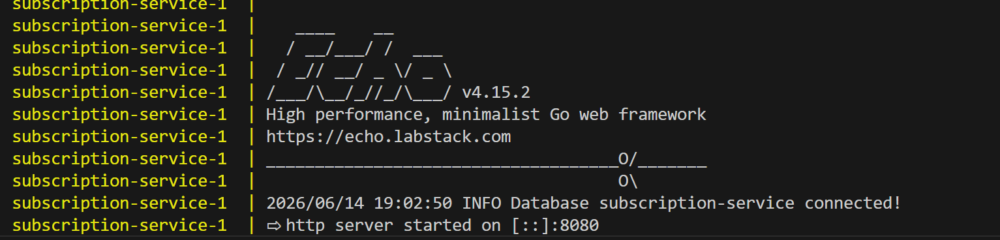
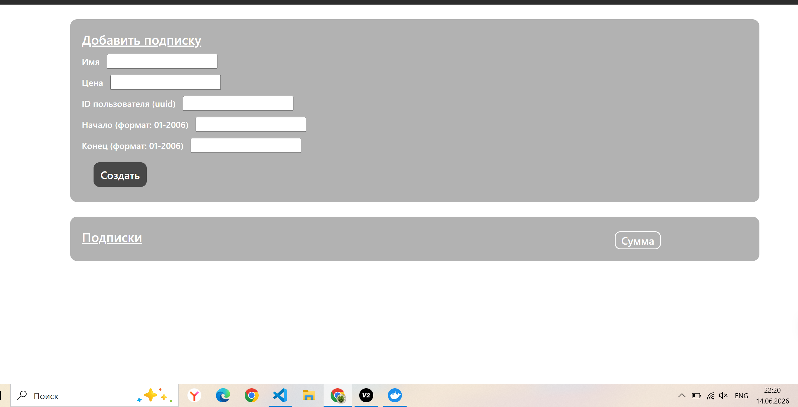

## REST-сервис для агрегации данных об онлайн подписках пользователей
### Тестовое задание Junior Golang Developer Effective Mobile

Swagger-документация 👉 localhost:8080/swagger/index.html

### Запуск

для запуска приложения:

1) клонируйте репозиторий

``` git clone https://github.com/roma106/test-task-effective-mobile-junior-golang ```

2) поднимите docker compose

``` docker compose up --build ```

3) Дождитесь запуска сервера



4) Откройте в браузере страничку:

``` http://localhost:8080/ ```



При возникновении любых проблем или вопросов обращайтесь:

### Контакты

 - Telegram: t.me/Romanovski228
 - Email: roma106ivanovskiy@mail.ru